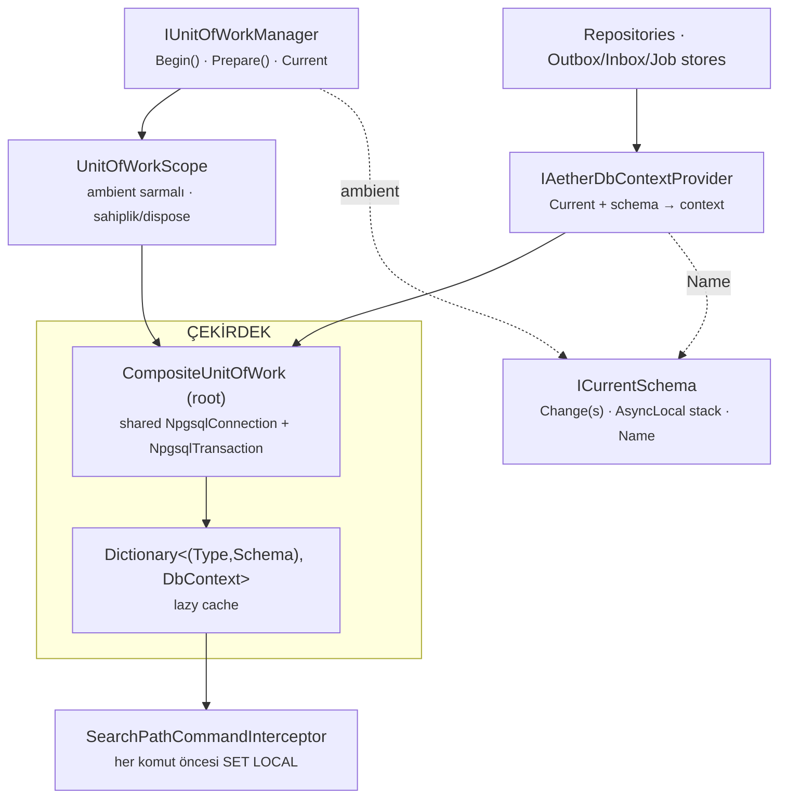

# Multi-Schema Unit of Work — Adoption & Internals Guide

> Tek bir PostgreSQL veritabanında, farklı schema'lara yayılan veriyi **tek transaction sınırı**
> içinde tutarlı okuyup yazmak için. Bu doküman iki bölümdür:
> **(A)** başka bir projeye nasıl entegre edilir & nelere dikkat edilir,
> **(B)** yapının içeride nasıl çalıştığı.
>
> İlgili dokümanlar: [`unit-of-work/README.md`](../unit-of-work/README.md),
> [`multi-schema/README.md`](./README.md), [`multi-schema/IMPLEMENTATION_NOTES.md`](./IMPLEMENTATION_NOTES.md).

**Hedef ortam:** PostgreSQL · EF Core 10 · .NET 10 · Npgsql (PgBouncer transaction pooling uyumlu).

---

## Özet — ne yapıyor?

| | |
|---|---|
| **Tek bağlantı, tek transaction** | Bir UnitOfWork tek bir `NpgsqlConnection` + tek `NpgsqlTransaction` açar. İhtiyaç duyulan her `(DbContext tipi, schema)` için lazy olarak ayrı bir DbContext üretir ve hepsini **aynı** transaction'a bağlar → schema'lar arası atomik commit/rollback. |
| **Çalışma zamanında schema** | Schema, `using (currentSchema.Change("flow_a"))` ile seçilen, iç içe geçebilen, otomatik geri alınan bir kapsamdır. Entity eşlemeleri schema'dan **bağımsızdır** (`ToTable("x")`). |
| **PgBouncer-uyumlu** | Schema her komuttan önce `SET LOCAL search_path` ile transaction içinde ayarlanır; session state'e sızmaz → transaction pooling altında güvenli. |

---

# Bölüm A — Başka bir projede uygulama

## Adım 1 — DbContext'i türet

DbContext'in `AetherDbContext<TSelf>`'ten türemeli. Eşlemelerde **schema argümanı verme**.

```csharp
public sealed class AppDbContext : AetherDbContext<AppDbContext>
{
    // Yalnız options ctor'u yeterli. IDomainEventSink/IClock opsiyoneldir,
    // DI (ActivatorUtilities) gerekirse doldurur; event yönlendirme bunlara bağlı değildir.
    public AppDbContext(DbContextOptions<AppDbContext> options) : base(options) { }

    public DbSet<Order> Orders => Set<Order>();

    protected override void OnModelCreating(ModelBuilder b)
    {
        base.OnModelCreating(b);
        b.Entity<Order>().ToTable("orders");   // ← schema YOK
        b.ConfigureOutbox();                    // IHasEfCoreOutbox uyguluyorsa
    }
}
```

## Adım 2 — DI kaydı (connection string'i AÇIKÇA ver)

`AddAetherDbContext` artık connection string'i **ayrı parametre** olarak alır — UoW kendi
paylaşılan bağlantısını bu string'ten açar. `AuditInterceptor` otomatik eklenir;
`AddAetherUnitOfWork` içeride çağrılır.

```csharp
services.AddAetherCore(_ => { });

services.AddAetherDbContext<AppDbContext>(
    connectionString,
    (sp, options) => options.UseNpgsql(connectionString));

// Opsiyonel yetenekler (gerektikçe):
services.AddAetherDomainEvents<AppDbContext>();  // domain event → outbox
services.AddAetherOutbox<AppDbContext>();        // transactional outbox + processor
services.AddAetherInbox<AppDbContext>();
services.AddAetherBackgroundJob<AppDbContext>();
```

> ⚠️ **Kırıcı değişiklik:** Eski `AddAetherDbContext<T>(options => …)` (connection string'siz)
> imzası kaldırıldı. `NpgsqlSchemaConnectionInterceptor` de silindi — artık eklemeyin.

## Adım 3 — HTTP pipeline (sıralama önemli)

Schema çözümü, UnitOfWork'ten **önce** gelmeli ki UoW başlarken aktif schema kapsamı bulunsun.

```csharp
app.UseSchemaResolution();   // header/route/query → currentSchema.Change(...) (request boyunca)
app.UseAetherUnitOfWork();   // ambient UoW'u Prepare eder
```

Controller/handler metodlarında `[UnitOfWork]` aspect'i transaction sınırını yönetir;
repository'ler ambient UoW'u kendiliğinden kullanır.

## Adım 4 — Arka plan worker'ları için schema ver

Pollerlar (outbox/inbox) request olmadığı için ambient schema bulamaz. İşlenecek schema'yı
**konfigüre et**. Çok-schema dağıtımında her schema için ayrı processor instance çalıştır.

```csharp
services.Configure<AetherOutboxOptions>(o => o.Schema = "flow_orders");
services.Configure<AetherInboxOptions>(o => o.Schema = "flow_orders");
```

## Adım 5 — Migration / şema oluşturma

Model schema'dan bağımsız olduğu için EF tabloları *niteliksiz* üretir. Tabloları doğru schema'ya
yerleştirmek senin sorumluluğunda: önce `CREATE SCHEMA`, sonra o schema'nın `search_path`'i
altında migration/DDL çalıştır (ör. her schema için ayrı migration uygulaması veya
`search_path` ayarlı bir bağlantı).

---

## Kullanım kalıpları

### 1) İstek içinde (otomatik) — ek bir şey gerekmez

Middleware schema'yı set eder, aspect UoW'u yönetir. Servisinde sadece repository inject et:

```csharp
public OrderService(IRepository<Order, Guid> repo) => _repo = repo;

[UnitOfWork(IsTransactional = true)]
public async Task CreateAsync(Order order)
    => await _repo.InsertAsync(order);   // aktif request schema'sına yazar
```

### 2) Programatik / arka plan — `Begin()` kullan (`BeginAsync` DEĞİL)

> 🛑 **Kritik:** Programatik kodda `uowManager.Begin(...)` (senkron) kullan.
> `await uowManager.BeginAsync(...)` UoW'u çağıranın akışında ambient yapmaz
> (bkz. Bölüm B → "Ambient") → repository/store `"No active UnitOfWork"` fırlatır.

```csharp
using (currentSchema.Change("flow_a"))
await using (var uow = uowManager.Begin(
        new UnitOfWorkOptions { Scope = UnitOfWorkScopeOption.RequiresNew, IsTransactional = true }))
{
    var db = await dbContextProvider.GetDbContextAsync();   // flow_a'ya bağlı
    db.Set<Order>().Add(order);
    await uow.CommitAsync();
}
```

### 3) Tek transaction'da birden çok schema

```csharp
await using var uow = uowManager.Begin(
    new UnitOfWorkOptions { Scope = UnitOfWorkScopeOption.RequiresNew, IsTransactional = true });

using (currentSchema.Change("flow_customer"))
{
    var dbC = await dbContextProvider.GetDbContextAsync();
    dbC.Set<Customer>().Add(customer);
}
using (currentSchema.Change("flow_kyc"))
{
    var dbK = await dbContextProvider.GetDbContextAsync();
    dbK.Set<KycRecord>().Add(kyc);
}

await uow.CommitAsync();   // iki schema TEK transaction'da commit olur (ya hep ya hiç)
```

---

## Nelere dikkat etmeli

| Konu | Açıklama |
|---|---|
| **🔁 Begin vs BeginAsync** | Repository/store/context çözecek her programatik akışta senkron `Begin()`/`BeginRequiresNew()` kullan. `BeginAsync` yalnız ambient'a ihtiyaç duymayan durumlar için bırakıldı. |
| **🧱 ToTable'da schema yok** | `ToTable("x", "schema")` veya `HasDefaultSchema` kullanma. Schema runtime'da `search_path` ile çözülür; modele gömülürse EF model cache schema başına kirlenir. |
| **⏱️ Transaction'ı kısa tut** | PgBouncer transaction pooling: açık transaction içinde **dış servis çağrısı yapma** (HTTP, mesaj broker). Outbox processor bu yüzden lease→publish→update olarak 3 faza ayrılmıştır. |
| **📥 Poller başına tek schema** | Outbox/Inbox processor tek `Schema` işler. Birden çok schema varsa her biri için ayrı instance çalıştır; `Schema` boşsa processor uyarı loglar ve çalışmaz. |
| **🏷️ Job'lar schema taşımalı** | Background job kuyruğa alınırken `currentSchema.Name` envelope'a yazılır. Hiçbir schema kapsamı yokken enqueue edilen job'da schema null olur ve dispatch sırasında hata verir. |
| **🔢 MaxDbContextCount** | Tek UoW içinde farklı `(tip, schema)` sayısı varsayılan **16** ile sınırlıdır (guardrail). 50+ schema'yı aynı UoW'da gezme — uzun transaction riski. |
| **🐘 Sadece PostgreSQL** | Shared-connection modeli Npgsql'e bağlıdır; `BBT.Aether.Infrastructure` artık doğrudan Npgsql'e bağımlıdır. SQL Server interceptor'ı kaldırıldı. |
| **✍️ Schema adı kuralı** | Schema adı `^[a-zA-Z_][a-zA-Z0-9_]*$` deseniyle doğrulanır (SQL injection'a karşı). Geçersiz ad `InvalidOperationException` verir. |

---

## Hata sözlüğü (ne zaman çıkar?)

| Mesaj | Sebep / çözüm |
|---|---|
| `Current schema is not set.` | Aktif `Change(...)` kapsamı yok. Provider/repository çağrısını bir `using (currentSchema.Change("…"))` içine al (veya request'te `UseSchemaResolution` ekli mi kontrol et). |
| `No active UnitOfWork.` | Ambient UoW yok. Programatik kodda `BeginAsync` yerine senkron `Begin()` kullan; istekte `UseAetherUnitOfWork` + `[UnitOfWork]` var mı bak. |
| `UnitOfWork DbContext limit exceeded. Limit: N` | Tek UoW'da çok fazla farklı `(tip, schema)`. Tasarımı gözden geçir veya `UnitOfWorkOptions.MaxDbContextCount`'u bilinçli artır. |
| `Invalid PostgreSQL schema name: X` | Schema adı geçersiz karakter içeriyor. |
| `Unit of work is prepared but not initialized.` | Hazırlanmış (prepared) UoW henüz initialize edilmeden context istendi. İstek akışında aspect/`[UnitOfWork]` başlatmadan önce DB erişimi olmuş. |
| `Schema scope corrupted: out-of-order disposal detected.` | `Change(...)` kapsamları iç içe ve sırasıyla dispose edilmeli; `using` kullan, elle Dispose'u karıştırma. |

---

# Bölüm B — İç işleyiş

## Bileşenler



| Parça | Görev |
|---|---|
| `ICurrentSchema` | Aktif schema'yı `AsyncLocal` bir *stack*'te tutar. `Change(s)` push eder ve dispose'ta pop eder (iç içe, otomatik geri alma). |
| `IUnitOfWorkManager` | UoW yaratır ve ambient'ı yönetir: `Begin` (senkron), `Prepare` (istek), `BeginAsync` (legacy). `Current` aktif UoW'u verir. |
| `CompositeUnitOfWork` | Kök. Tek `NpgsqlConnection`+`NpgsqlTransaction` sahibi; `(tip,schema)` başına DbContext üretir; commit/rollback ve event/outbox boru hattını yürütür. |
| `UnitOfWorkScope` | Kökü saran ambient katman. `accessor.Current`'ı set/restore eder; **sahibi** ise dispose'ta kökü (ve bağlantıyı) kapatır. |
| `IAetherDbContextProvider` | `ICurrentSchema.Name` + `manager.Current`'tan schema-bağlı context'i çözer. Repository ve store'lar bunu kullanır. |
| `SearchPathCommandInterceptor` | Her EF komutundan önce `SET LOCAL search_path` çalıştırır (`SearchPathState` ile gereksiz tekrarları atlar). |

## Bir UoW'nin yaşam döngüsü

```text
Begin(RequiresNew)            → scope ambient olur, BAĞLANTI HENÜZ AÇILMAZ
                                 (tek maliyet: nesne; boş UoW bedava)
İlk GetDbContextAsync(flow_a) → NpgsqlConnection.Open + BeginTransaction (lazy, bir kez)
                               → configurator options + SET LOCAL interceptor + UseTransaction
                               → context cache'e konur; LocalEventEnqueuer bağlanır
Change(flow_b)+GetDbContext   → AYNI bağlantı/transaction; yeni schema-bağlı context
İş (Add/Update/Query)         → her komut öncesi SET LOCAL search_path
CommitAsync()                 → SaveChanges(tüm context) → event'ler outbox'a (tx içinde)
                               → SaveChanges → TEK transaction.Commit → OnCompleted hook'ları
DisposeAsync (sahip scope)    → commit olmadıysa rollback
                               → context/transaction/CONNECTION kapatılır
```

Bağlantı ilk context istendiğinde **lazy** açılır; **sahibi** olan scope dispose'unda kapanır
(bağlantı sızıntısını önleyen sahiplik kuralı).

## Ambient mekanizması — Begin vs Prepare vs BeginAsync

UoW, `AsyncLocal` üzerinden "ambient" taşınır: repository'ye UoW'u elle geçirmezsin,
`manager.Current` bulur. Kritik incelik: **AsyncLocal yazımı bir `async` metodun içinde
yapılırsa çağırana geri sızmaz.**

| Yöntem | Ambient? | Ne zaman |
|---|:---:|---|
| `Begin()` | ✅ | Senkron. Scope ctor `Current`'ı *çağıranın* frame'inde set eder → aşağı akar. **Programatik/arka plan için doğru seçim.** |
| `Prepare()` | ✅ | İstek yolunda middleware senkron `Prepare` ile ambient'ı kurar; `[UnitOfWork]` aspect'i sonradan initialize eder. HTTP yolu sorunsuz. |
| `BeginAsync()` | ❌ | Ambient ataması `async` metodun içinde kalır, `await` sonrası çağırana geçmez → `Current` null. Sadece geriye uyumluluk için duruyor. |

> Bu davranış `AmbientBeginTests` ile bilerek doğrulanır: `Begin` sonrası `Current` dolu;
> `BeginAsync` sonrası null. Tüm programatik çağrılar (job, dispatcher, poller, aspect fallback)
> `Begin`'e taşındı.

## Neden her komutta `SET LOCAL`?

`SET LOCAL search_path` **transaction** kapsamlıdır. Aynı transaction'ı paylaşan `flow_a` ve
`flow_b` context'leri olduğunda, context oluştururken bir kez set etmek yetmez: en son set eden
schema, sonraki **tüm** komutlara uygulanır → yanlış schema. Çözüm:
`SearchPathCommandInterceptor` her komuttan hemen önce ilgili schema'yı tekrar set eder
(tek bağlantıda komutlar sıralı çalıştığı için güvenli); `SearchPathState` aynı schema arka arkaya
gelirse SET'i atlar.

> ⚠️ Tasarım dokümanındaki "bir kez SET LOCAL" yaklaşımı yanlıştı ve implementasyon sırasında
> testlerle yakalandı; per-komut interceptor + skip optimizasyonu ile düzeltildi.

> ✅ **PgBouncer garantisi:** `SET LOCAL` transaction bitince otomatik silinir, session state'e
> sızmaz. `PgBouncerSearchPathTests` bunu kanıtlar: commit sonrası taze bağlantının
> `search_path`'inde UoW schema'sı görülmez.

## Commit & domain event / outbox

Varsayılan strateji `AlwaysUseOutbox`:

1. Tüm materyalize context'lerde `SaveChanges` (değişiklik varsa).
2. Aggregate'lerin ürettiği domain event'ler UoW buffer'ında toplanır; `IDomainEventDispatcher`
   bunları **outbox tablosuna yazar** — outbox satırları da aynı paylaşılan transaction'ın parçası.
3. Outbox satırlarını kalıcılaştırmak için tekrar `SaveChanges`.
4. **Tek** `transaction.Commit` → iş verisi + outbox atomik.
5. `OnCompleted` hook'ları (ör. job scheduler çağrısı) — commit'ten *sonra*.

Alternatif `PublishWithFallback`: önce commit, sonra doğrudan publish; hata olursa yeni bir
scope'ta outbox'a yazar. `OnCompleted/OnFailed/OnDisposed` hook'ları her iki stratejide korunur.

**Outbox processor** (arka plan) ise PgBouncer kuralı gereği **3 faza** ayrılmıştır:
(1) lease — kısa transaction, commit; (2) publish — açık transaction *yok*;
(3) status update — ayrı kısa transaction. Böylece dış broker çağrısı asla açık transaction
içinde yapılmaz.

---

## Kaynaklar

- Çekirdek tipler: `framework/src/BBT.Aether.Infrastructure/BBT/Aether/Uow/`
- Schema: `framework/src/BBT.Aether.Core/BBT/Aether/MultiSchema/`
- Doğrulama (Testcontainers PostgreSQL): `framework/test/BBT.Aether.Postgres.Tests/`
