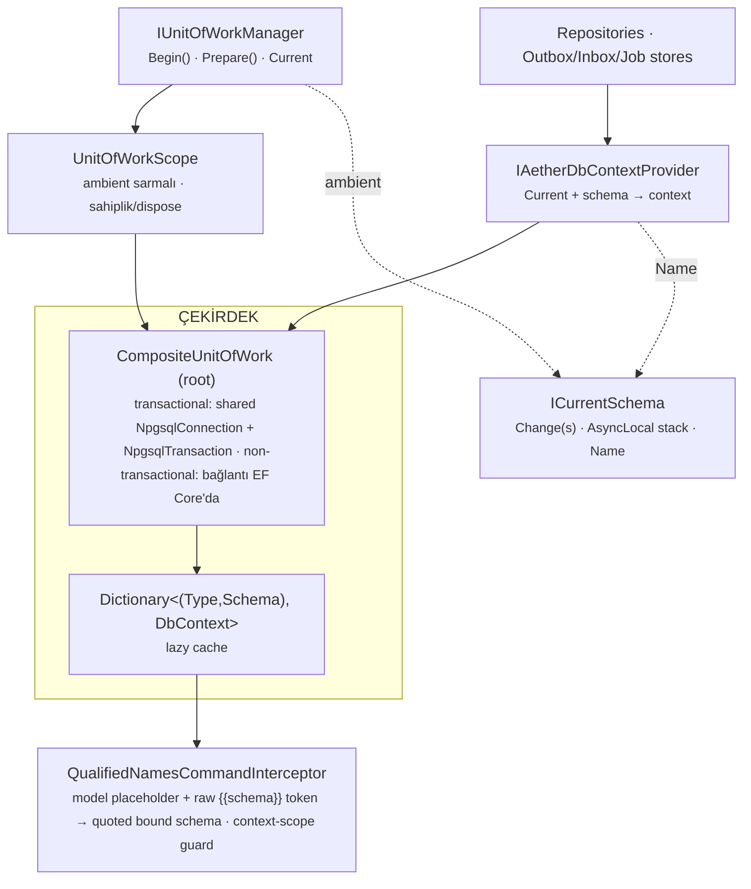

# Multi-Schema Unit of Work — Adoption & Internals Guide

> Tek bir PostgreSQL veritabanında, farklı schema'lara yayılan veriyi **tek transaction sınırı**
> içinde tutarlı okuyup yazmak için. Bu doküman iki bölümdür:
> **(A)** başka bir projeye nasıl entegre edilir & nelere dikkat edilir,
> **(B)** yapının içeride nasıl çalıştığı.
>
> İlgili dokümanlar: [`unit-of-work/README.md`](../unit-of-work/README.md),
> [`multi-schema/README.md`](./README.md), [`multi-schema/IMPLEMENTATION_NOTES.md`](./IMPLEMENTATION_NOTES.md).

**Hedef ortam:** PostgreSQL · EF Core 10 · .NET 10 · Npgsql (PgBouncer transaction pooling uyumlu).

---

## Özet — ne yapıyor?

| | |
|---|---|
| **Transactional'da tek bağlantı, non-transactional'da hiç bağlantı** | `IsTransactional = true` ise UnitOfWork tek bir `NpgsqlConnection` ve tek bir `NpgsqlTransaction` açar; ihtiyaç duyulan her `(DbContext tipi, schema)` için lazy olarak ayrı bir DbContext üretir ve hepsini **aynı** transaction'a bağlar → schema'lar arası atomik commit/rollback. `IsTransactional = false` ise UoW **hiç fiziksel bağlantı açmaz**: context'ler `UseNpgsql(connectionString)` ile bağlanır, bağlantı yaşam döngüsünü EF Core yönetir (her operasyon için pool'dan bağlantı alır, hemen iade eder). |
| **Çalışma zamanında schema** | Schema, `using (currentSchema.Change("flow_a"))` ile seçilen, iç içe geçebilen, otomatik geri alınan bir kapsamdır. Entity eşlemeleri schema'dan **bağımsızdır** (`ToTable("x")`). |
| **Her pool ile uyumlu** | Tek strateji `QualifiedNames`: bağlantı state'i kullanmadan her relation'ı runtime schema ile niteler; `search_path` hiç değiştirilmez. PgBouncer transaction/session pooling ve native pool altında güvenlidir. Non-transactional UoW ayrıca hiç bağlantı tutmadığı için pool baskısı da düşüktür. |

---

# Bölüm A — Başka bir projede uygulama

## Adım 1 — DbContext'i türet

DbContext'in `AetherDbContext<TSelf>`'ten türemeli. Eşlemelerde **schema argümanı verme**.

```csharp
public sealed class AppDbContext : AetherDbContext<AppDbContext>
{
    // Yalnız options ctor'u yeterli. IClock opsiyoneldir,
    // DI (ActivatorUtilities) gerekirse doldurur; event yönlendirme buna bağlı değildir.
    public AppDbContext(DbContextOptions<AppDbContext> options) : base(options) { }

    public DbSet<Order> Orders => Set<Order>();

    protected override void OnModelCreating(ModelBuilder b)
    {
        base.OnModelCreating(b);
        b.Entity<Order>().ToTable("orders");   // ← schema YOK
        b.ConfigureOutbox();                    // IHasEfCoreOutbox uyguluyorsa
    }
}
```

## Adım 2 — DI kaydı (provider paketini seç, connection string'i AÇIKÇA ver)

`BBT.Aether.Infrastructure` artık **provider-agnostik** — Npgsql bağımlılığı yok. UoW,
[`IAetherDatabaseProvider`](../../src/BBT.Aether.Infrastructure/BBT/Aether/Uow/EntityFrameworkCore/IAetherDatabaseProvider.cs)
seam'i üzerinden tek bir paylaşılan `DbConnection` ile konuşur. Bir provider paketi seç:

- **`BBT.Aether.Npgsql`** — PostgreSQL, tam çok-schema → `AddAetherNpgsql<T>(connectionString [, mode])`
- **`BBT.Aether.SqlServer`** — SQL Server, tek-schema → `AddAetherSqlServer<T>(connectionString)`

Her ikisi de connection string'i **ayrı parametre** olarak alır — UoW kendi paylaşılan
bağlantısını bu string'ten açar. `AuditInterceptor` otomatik eklenir; `AddAetherUnitOfWork`
içeride çağrılır.

```csharp
services.AddAetherCore(_ => { });

// PostgreSQL — qualified names (tek strateji; her pool ile uyumlu):
services.AddAetherNpgsql<AppDbContext>(connectionString);

// veya SQL Server (tek-schema):
// services.AddAetherSqlServer<AppDbContext>(connectionString);

// Opsiyonel yetenekler (gerektikçe):
services.AddAetherDomainEvents<AppDbContext>();  // domain event → outbox
services.AddAetherOutbox<AppDbContext>();        // transactional outbox + processor (yalnız PostgreSQL)
services.AddAetherInbox<AppDbContext>();          // (yalnız PostgreSQL)
services.AddAetherBackgroundJob<AppDbContext>();
```

`SchemaSwitchingMode` enum'unun artık tek üyesi var: `QualifiedNames`. Eski `TransactionLocal`
ve `SessionSearchPath` modları (ve tüm `search_path` manipülasyonu) kaldırıldı.
`AddAetherNpgsql(connectionString, mode = SchemaSwitchingMode.QualifiedNames, configure)`
imzasındaki opsiyonel `mode` parametresi yalnız imza uyumluluğu için duruyor.

| Değer | Komut | Transaction gerekli? | Pool uyumu |
|-------|-------|----------------------|-----------|
| `QualifiedNames` (tek strateji) | EF relation placeholder'ını ve raw SQL'deki `{{schema}}` token'ını niteler; `SET`/`RESET` yok | Hayır | PgBouncer transaction/session pooling ✅, native pool ✅ |

Özel bir provider için çekirdek overload'ı doğrudan çağır:
`services.AddAetherDbContext<AppDbContext>(new NpgsqlAetherProvider(), connectionString, configure?)`
(`NpgsqlAetherProvider` artık parametresizdir).

> ⚠️ **Kırıcı değişiklik:** Eski `AddAetherDbContext<T>(options => …)` (connection string'siz)
> imzası kaldırıldı. `NpgsqlSchemaConnectionInterceptor` de silindi — artık eklemeyin.

## Adım 3 — HTTP pipeline (sıralama önemli)

Schema çözümü, UnitOfWork'ten **önce** gelmeli ki UoW başlarken aktif schema kapsamı bulunsun.

```csharp
app.UseSchemaResolution();   // header/route/query → currentSchema.Change(...) (request boyunca)
app.UseAetherUnitOfWork();   // ambient UoW'u Prepare eder
```

Controller/handler metodlarında `[UnitOfWork]` aspect'i transaction sınırını yönetir;
repository'ler ambient UoW'u kendiliğinden kullanır.

## Adım 4 — Arka plan worker'ları için schema ver

Pollerlar (outbox/inbox) request olmadığı için ambient schema bulamaz. İşlenecek schema'yı
**konfigüre et**. Çok-schema dağıtımında her schema için ayrı processor instance çalıştır.

```csharp
services.Configure<AetherOutboxOptions>(o => o.Schema = "flow_orders");
services.Configure<AetherInboxOptions>(o => o.Schema = "flow_orders");
```

## Adım 5 — Migration / şema oluşturma

Model schema'dan bağımsız olduğu için EF tabloları *niteliksiz* üretir. Tabloları doğru schema'ya
yerleştirmek senin sorumluluğunda: önce `CREATE SCHEMA`, sonra o schema'nın `search_path`'i
altında migration/DDL çalıştır (ör. her schema için ayrı migration uygulaması veya
`search_path` ayarlı bir bağlantı).

---

## Kullanım kalıpları

### 1) İstek içinde (otomatik) — ek bir şey gerekmez

Middleware schema'yı set eder, aspect UoW'u yönetir. Servisinde sadece repository inject et:

```csharp
public OrderService(IRepository<Order, Guid> repo) => _repo = repo;

[UnitOfWork(IsTransactional = true)]
public async Task CreateAsync(Order order)
    => await _repo.InsertAsync(order);   // aktif request schema'sına yazar
```

### 2) Programatik / arka plan — `Begin()` kullan (`BeginAsync` DEĞİL)

> 🛑 **Kritik:** Programatik kodda `uowManager.Begin(...)` (senkron) kullan.
> `await uowManager.BeginAsync(...)` UoW'u çağıranın akışında ambient yapmaz
> (bkz. Bölüm B → "Ambient") → repository/store `"No active UnitOfWork"` fırlatır.

**Transactional (paylaşılan bağlantı + tek transaction):**

```csharp
using (currentSchema.Change("flow_a"))
await using (var uow = uowManager.Begin(
        new UnitOfWorkOptions { Scope = UnitOfWorkScopeOption.RequiresNew, IsTransactional = true }))
{
    var db = await dbContextProvider.GetDbContextAsync();   // flow_a'ya bağlı
    db.Set<Order>().Add(order);
    await uow.CommitAsync();
}
```

**Non-transactional (UoW bağlantı tutmaz — okuma ağırlıklı işler için ideal):**

```csharp
using (currentSchema.Change("flow_a"))
await using (var uow = uowManager.Begin(
        new UnitOfWorkOptions { Scope = UnitOfWorkScopeOption.RequiresNew, IsTransactional = false }))
{
    var db = await dbContextProvider.GetDbContextAsync();   // flow_a'ya bağlı, transaction yok
    var list = await db.Set<Order>().ToListAsync();
    // UoW fiziksel bağlantı açmaz: EF Core her operasyon için pool'dan bağlantı alır,
    // hemen iade eder → bağlantı-pool baskısı düşer, search_path temizliği gerekmez.
}
```

**Aynı repository ile runtime schema geçişi:**

```csharp
await using var uow = uowManager.Begin(new UnitOfWorkOptions
{
    Scope = UnitOfWorkScopeOption.RequiresNew,
    IsTransactional = true
});

using (currentSchema.Change("tenant_a"))
{
    await repository.GetListAsync();
}

using (currentSchema.Change("tenant_b"))
{
    var rows = await repository.GetListAsync(); // aynı repository, tenant_b context'i
    var db = await dbContextProvider.GetDbContextAsync();

    await db.Database.ExecuteSqlRawAsync(
        "UPDATE {{schema}}.\"orders\" SET \"Status\" = {0}",
        status);
}

await uow.CommitAsync();
```

`FromSqlRaw` ve `ExecuteSqlRaw` içindeki schema-bağımlı her relation için exact
`{{schema}}` token'ını kullan. Token yalnız SQL kod bölgelerinde değiştirilir; string/escape
string literal'ları, quoted identifier'lar, satır ve nested blok yorumları ile dollar-quoted
body'lerdeki metin korunur. Parametreler aynen parametre kalır. `SELECT 1` gibi
schema-bağımsız SQL token gerektirmez.

Service/repository instance'ları schema scope'ları arasında tekrar kullanılabilir. Buna karşılık
bir scope'ta resolve edilmiş `DbContext`, `DbSet` veya `IQueryable` başka scope'a taşınamaz;
QualifiedNames bunu DB erişiminden önce hata vererek engeller. Yeni scope'ta provider/repository
üzerinden tekrar resolve et.

### 3) Tek transaction'da birden çok schema

```csharp
await using var uow = uowManager.Begin(
    new UnitOfWorkOptions { Scope = UnitOfWorkScopeOption.RequiresNew, IsTransactional = true });

using (currentSchema.Change("flow_customer"))
{
    var dbC = await dbContextProvider.GetDbContextAsync();
    dbC.Set<Customer>().Add(customer);
}
using (currentSchema.Change("flow_kyc"))
{
    var dbK = await dbContextProvider.GetDbContextAsync();
    dbK.Set<KycRecord>().Add(kyc);
}

await uow.CommitAsync();   // iki schema TEK transaction'da commit olur (ya hep ya hiç)
```

---

## Nelere dikkat etmeli

| Konu | Açıklama |
|---|---|
| **🔁 Begin vs BeginAsync** | Repository/store/context çözecek her programatik akışta senkron `Begin()`/`BeginRequiresNew()` kullan. `BeginAsync` yalnız ambient'a ihtiyaç duymayan durumlar için bırakıldı. |
| **🧱 ToTable'da schema yok** | `ToTable("x", "schema")` veya `HasDefaultSchema` kullanma. Schema runtime'da qualified-names rewriting ile çözülür; modele tenant schema'sı gömülürse EF model cache schema başına kirlenir. |
| **🔀 Tek strateji: QualifiedNames** | `QualifiedNames` bağlantı state'i kullanmaz, transaction gerektirmez ve raw SQL için `{{schema}}` token'ı ister. Her pooling modeli (PgBouncer transaction/session pooling, native pool) altında güvenlidir. Eski `TransactionLocal` ve `SessionSearchPath` modları kaldırıldı. |
| **🔒 Scope'a bağlı nesneler** | Repository/service tekrar kullanılabilir; resolve edilmiş DbContext, DbSet ve IQueryable schema scope'ları arasında tekrar kullanılamaz. |
| **⏱️ Transaction'ı kısa tut** | Açık transaction içinde **dış servis çağrısı yapma** (HTTP, mesaj broker) — özellikle PgBouncer transaction pooling altında bağlantıyı gereksiz pinler. Outbox processor bu yüzden lease→publish→update olarak 3 faza ayrılmıştır. |
| **📥 Poller başına tek schema** | Outbox/Inbox processor tek `Schema` işler. Birden çok schema varsa her biri için ayrı instance çalıştır; `Schema` boşsa processor uyarı loglar ve çalışmaz. |
| **🏷️ Job'lar schema taşımalı** | Background job kuyruğa alınırken `currentSchema.Name` envelope'a yazılır. Hiçbir schema kapsamı yokken enqueue edilen job'da schema null olur ve dispatch sırasında hata verir. |
| **🔢 MaxDbContextCount** | Tek UoW içinde farklı `(tip, schema)` sayısı varsayılan **16** ile sınırlıdır (guardrail). 50+ schema'yı aynı UoW'da gezme — uzun transaction riski. |
| **🐘 Çok-schema = PostgreSQL** | `BBT.Aether.Infrastructure` provider-agnostiktir; PostgreSQL desteği `BBT.Aether.Npgsql`'de yaşar. Çalışma zamanı çok-schema ve Outbox/Inbox işleme **yalnız PostgreSQL'dedir** (aşağıdaki SQL Server kısıtlarına bak). |
| **✍️ Schema adı kuralı** | Schema adı `^[a-zA-Z_][a-zA-Z0-9_]*$` deseniyle doğrulanır (SQL injection'a karşı). Geçersiz ad `InvalidOperationException` verir. |

---

## SQL Server kısıtları

SQL Server `BBT.Aether.SqlServer` (`SqlServerAetherProvider`) ile desteklenir, ancak yalnızca
**tek-schema** provider olarak. Paylaşılan bağlantı/transaction'ı sağlar ve `UseSqlServer`'ı
bağlar, fakat PostgreSQL provider'daki çalışma-zamanı relation qualification veya schema
switching mekanizmalarını implemente etmez.

- **Yalnız tek-schema.** Schema'yı modele bağla: `modelBuilder.HasDefaultSchema("x")` veya
  schema-nitelikli `ToTable("orders", "x")`. Çalışma zamanı komut-başına schema değişimi yok.
- **Tek transaction'da çalışma-zamanı çok-schema (runtime `Change()` ile schema'lar arası)
  yalnız PostgreSQL'dedir.** PostgreSQL provider bunu qualified-names relation rewriting
  (`QualifiedNames`) ile sağlar; SQL Server provider'da eşdeğer runtime relation
  rewriting/schema-switching desteği yoktur.
- **Outbox/Inbox işleme henüz SQL Server'da desteklenmiyor.** İşleme şu an PostgreSQL'e özgü
  lease SQL'i (`FOR UPDATE SKIP LOCKED`, `EfCoreOutboxStore` / `EfCoreInboxStore`) kullanır;
  SQL Server desteği bir sonraki adım.

---

## Hata sözlüğü (ne zaman çıkar?)

| Mesaj | Sebep / çözüm |
|---|---|
| `Current schema is not set.` | Aktif `Change(...)` kapsamı yok. Provider/repository çağrısını bir `using (currentSchema.Change("…"))` içine al (veya request'te `UseSchemaResolution` ekli mi kontrol et). |
| `No active UnitOfWork.` | Ambient UoW yok. Programatik kodda `BeginAsync` yerine senkron `Begin()` kullan; istekte `UseAetherUnitOfWork` + `[UnitOfWork]` var mı bak. |
| `UnitOfWork DbContext limit exceeded. Limit: N` | Tek UoW'da çok fazla farklı `(tip, schema)`. Tasarımı gözden geçir veya `UnitOfWorkOptions.MaxDbContextCount`'u bilinçli artır. |
| `Invalid PostgreSQL identifier: X` | Schema adı geçersiz karakter içeriyor. |
| `Unit of work is prepared but not initialized.` | Hazırlanmış (prepared) UoW henüz initialize edilmeden context istendi. İstek akışında aspect/`[UnitOfWork]` başlatmadan önce DB erişimi olmuş. |
| `Schema scope corrupted: out-of-order disposal detected.` | `Change(...)` kapsamları iç içe ve sırasıyla dispose edilmeli; `using` kullan, elle Dispose'u karıştırma. |

---

# Bölüm B — İç işleyiş

## Bileşenler


```mermaid
flowchart TB
    CS["ICurrentSchema<br/><small>Change(s) · AsyncLocal stack · Name</small>"]
    MGR["IUnitOfWorkManager<br/><small>Begin() · Prepare() · Current</small>"]
    subgraph CORE["ÇEKİRDEK"]
      CUOW["CompositeUnitOfWork (root)<br/><small>transactional: shared NpgsqlConnection + NpgsqlTransaction · non-transactional: bağlantı EF Core'da</small>"]
      CACHE["Dictionary&lt;(Type,Schema), DbContext&gt;<br/><small>lazy cache</small>"]
    end
    SCOPE["UnitOfWorkScope<br/><small>ambient sarmalı · sahiplik/dispose</small>"]
    PROV["IAetherDbContextProvider<br/><small>Current + schema → context</small>"]
    INT["QualifiedNamesCommandInterceptor<br/><small>model placeholder + raw {{schema}} token → quoted bound schema · context-scope guard</small>"]
    REPO["Repositories · Outbox/Inbox/Job stores"]

    MGR --> SCOPE --> CUOW --> CACHE
    MGR -.->|ambient| CS
    PROV --> CUOW
    REPO --> PROV
    CACHE --> INT
    PROV -.->|Name| CS
```

| Parça | Görev |
|---|---|
| `ICurrentSchema` | Aktif schema'yı `AsyncLocal` bir *stack*'te tutar. `Change(s)` push eder ve dispose'ta pop eder (iç içe, otomatik geri alma). |
| `IUnitOfWorkManager` | UoW yaratır ve ambient'ı yönetir: `Begin` (senkron), `Prepare` (istek), `BeginAsync` (legacy). `Current` aktif UoW'u verir. |
| `CompositeUnitOfWork` | Kök. `IsTransactional = true` ise tek `NpgsqlConnection` sahibi ve `NpgsqlTransaction` açar; `IsTransactional = false` ise hiç fiziksel bağlantı açmaz (bağlantı yaşam döngüsü EF Core'da). `(tip,schema)` başına DbContext üretir; commit/rollback ve event/outbox boru hattını yürütür. |
| `UnitOfWorkScope` | Kökü saran ambient katman. `accessor.Current`'ı set/restore eder; **sahibi** ise dispose'ta kökü (varsa bağlantıyı) kapatır. |
| `IAetherDbContextProvider` | `ICurrentSchema.Name` + `manager.Current`'tan schema-bağlı context'i çözer. Repository ve store'lar bunu kullanır. |
| `QualifiedNamesCommandInterceptor` | `(schema, currentSchema)` ile kurulur. Model placeholder'ını (`__aether_schema__`) ve raw SQL'deki `{{schema}}` token'ını quoted bound schema ile yeniden yazar; `ICurrentSchema.Name` context'in bağlı olduğu schema ile uyuşmuyorsa hata fırlatır. `search_path` komutu üretmez, transaction gerektirmez. |

## Bir UoW'nin yaşam döngüsü

**Transactional (IsTransactional = true):**

```text
Begin(RequiresNew)            → scope ambient olur, BAĞLANTI HENÜZ AÇILMAZ
                                 (tek maliyet: nesne; boş UoW bedava)
İlk GetDbContextAsync(flow_a) → NpgsqlConnection.Open + BeginTransaction (lazy, bir kez)
                               → configurator BuildOptions (paylaşılan bağlantı) +
                                 QualifiedNamesCommandInterceptor + UseTransaction
                               → context cache'e konur; LocalEventEnqueuer bağlanır
Change(flow_b)+GetDbContext   → AYNI bağlantı/transaction; yeni schema-bağlı context
İş (Add/Update/Query)         → placeholder / {{schema}} => "ilgili schema"; SET/RESET yok
CommitAsync()                 → SaveChanges(tüm context) → event'ler outbox'a (tx içinde)
                               → SaveChanges → TEK transaction.Commit → OnCompleted hook'ları
DisposeAsync (sahip scope)    → commit olmadıysa rollback
                               → context/transaction/CONNECTION kapatılır
```

**Non-transactional (IsTransactional = false):**

```text
Begin(RequiresNew)            → scope ambient olur, BAĞLANTI HİÇ AÇILMAZ
GetDbContextAsync(flow_a)     → configurator BuildOwnedOptions(schema)
                               → provider ApplyOwned: UseNpgsql(connectionString) +
                                 QualifiedNamesCommandInterceptor
                               → context cache'e konur; bağlantı yaşam döngüsü EF Core'da
Change(flow_b)+GetDbContext   → yeni schema-bağlı context; UoW yine bağlantı tutmaz
İş (Query)                    → EF Core her operasyon için pool'dan bağlantı alır, hemen iade eder
Eski flow_a query'sini çalıştır→ DB erişiminden önce context/current-schema mismatch hatası
DisposeAsync (sahip scope)    → context'ler kapatılır; kapatılacak bağlantı/transaction yok
```

Transactional akışta bağlantı ilk context istendiğinde **lazy** açılır ve **sahibi** olan scope
dispose'unda kapanır (bağlantı sızıntısını önleyen sahiplik kuralı). Non-transactional akışta
UoW hiçbir fiziksel bağlantı tutmaz — bu, okuma ağırlıklı işlerde bağlantı-pool baskısını azaltır.

## Ambient mekanizması — Begin vs Prepare vs BeginAsync

UoW, `AsyncLocal` üzerinden "ambient" taşınır: repository'ye UoW'u elle geçirmezsin,
`manager.Current` bulur. Kritik incelik: **AsyncLocal yazımı bir `async` metodun içinde
yapılırsa çağırana geri sızmaz.**

| Yöntem | Ambient? | Ne zaman |
|---|:---:|---|
| `Begin()` | ✅ | Senkron. Scope ctor `Current`'ı *çağıranın* frame'inde set eder → aşağı akar. **Programatik/arka plan için doğru seçim.** |
| `Prepare()` | ✅ | İstek yolunda middleware senkron `Prepare` ile ambient'ı kurar; `[UnitOfWork]` aspect'i sonradan initialize eder. HTTP yolu sorunsuz. |
| `BeginAsync()` | ❌ | Ambient ataması `async` metodun içinde kalır, `await` sonrası çağırana geçmez → `Current` null. Sadece geriye uyumluluk için duruyor. |

> Bu davranış `AmbientBeginTests` ile bilerek doğrulanır: `Begin` sonrası `Current` dolu;
> `BeginAsync` sonrası null. Tüm programatik çağrılar (job, dispatcher, poller, aspect fallback)
> `Begin`'e taşındı.

## Neden `search_path` değil, qualified names?

Eski `TransactionLocal` (`SET LOCAL search_path`) ve `SessionSearchPath` (session `SET
search_path` + dispose'da `RESET search_path`) yaklaşımları **bağlantı state'ine** dayanıyordu:
aynı bağlantıyı paylaşan `flow_a` ve `flow_b` context'lerinde en son set edilen schema sonraki
tüm komutlara uygulanmasın diye her komut öncesi yeniden set etmek, pool'a temiz session
dönebilsin diye dispose'da temizlik yapmak gerekiyordu. Bu modlar kaldırıldı.

Tek strateji artık **qualified names**: `QualifiedNamesCommandInterceptor` her komutta model
placeholder'ını ve raw `{{schema}}` token'ını, context'in bağlı olduğu quoted schema ile
yeniden yazar. Bağlantıya hiçbir schema state'i yazılmadığı için ne per-komut `SET` ne de
dispose temizliği vardır; transaction da gerekmez.

> ✅ **Pooling garantisi:** `search_path` hiç değiştirilmediği için session state'e sızacak bir
> şey yoktur — PgBouncer transaction/session pooling ve native pool altında güvenlidir.
> `PgBouncerSearchPathTests` bunu kanıtlar: qualified names, session `search_path`'ini asla
> mutate etmez.

## Commit & domain event / outbox

Varsayılan strateji `AlwaysUseOutbox`:

1. Tüm materyalize context'lerde `SaveChanges` (değişiklik varsa).
2. Aggregate'lerin ürettiği domain event'ler UoW buffer'ında toplanır; `IDomainEventDispatcher`
   bunları **outbox tablosuna yazar** — outbox satırları da aynı paylaşılan transaction'ın parçası.
3. Outbox satırlarını kalıcılaştırmak için tekrar `SaveChanges`.
4. **Tek** `transaction.Commit` → iş verisi + outbox atomik.
5. `OnCompleted` hook'ları (ör. job scheduler çağrısı) — commit'ten *sonra*.

Alternatif `PublishWithFallback`: önce commit, sonra doğrudan publish; hata olursa yeni bir
scope'ta outbox'a yazar. `OnCompleted/OnFailed/OnDisposed` hook'ları her iki stratejide korunur.

Non-transactional akışta `SaveChangesAsync`, iş verisini kaydeder ve event'leri üretildikleri
schema ile UoW buffer'ına alır; event yayınlamaz/outbox'a yazmaz. `CommitAsync`, buffer'ı schema
run'ları halinde ilgili schema altında outbox'a yazar veya doğrudan publish eder:

```text
Non-transactional SaveChanges -> business write plus schema-bound event buffer
Non-transactional Commit      -> schema-grouped outbox or direct dispatch
```

Transaction olmadığı için business write ile outbox write atomik değildir; aralarında process
çökerse iş verisi kalıcı olup outbox eksik kalabilir. Commit-boundary ve hata propagation
garantilenir, atomiklik değil. Consumer'lar idempotent olmalı ve recovery tasarlanmalıdır.

Nested `Required` scope mevcut root'a katılır ve fiziksel commit/dispose sahibi değildir. İç
`CommitAsync` yalnız kendi katılımını tamamlar; root'u dıştaki sahip commit eder. İç rollback
root'u abort eder. Non-transactional bir outer root'a transactional `Required` ile katılım
mümkün değildir ve `RequiresNew` kullanma yönlendirmesiyle fail-fast olur. Root'un effective
transaction modu başladığı anda sabittir; sonradan escalate edilmez.

**Outbox processor** (arka plan) ise PgBouncer kuralı gereği **3 faza** ayrılmıştır:
(1) lease — kısa transaction, commit; (2) publish — açık transaction *yok*;
(3) status update — ayrı kısa transaction. Böylece dış broker çağrısı asla açık transaction
içinde yapılmaz.

---

## Kaynaklar

- Çekirdek tipler: `framework/src/BBT.Aether.Infrastructure/BBT/Aether/Uow/`
- Schema: `framework/src/BBT.Aether.Core/BBT/Aether/MultiSchema/`
- Doğrulama (Testcontainers PostgreSQL): `framework/test/BBT.Aether.Postgres.Tests/`
